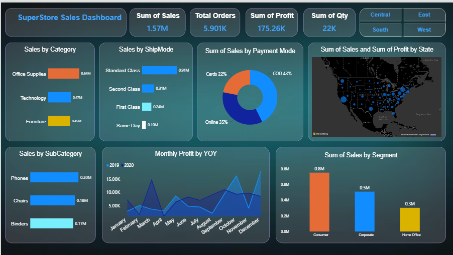

# SuperStore-Sales-Dashboard
Interactive SuperStore Sales Dashboard built using Power BI to analyze sales, profit, orders, quantity, category, ship mode, payment mode, region, state, subcategory, and segment performance.


# 📊 SuperStore Sales Dashboard


---

## 📌 About the Project

An interactive **SuperStore Sales Dashboard** created using **Microsoft Power BI** to analyze sales performance and generate meaningful business insights from SuperStore sales data.

The dashboard provides an interactive view of sales, profit, orders, quantity, categories, subcategories, regions, shipping modes, payment modes, states, and customer segments.

---

## 📸 Dashboard Preview

<p align="center">
  
</p>

---

## 🎯 Project Objectives

The main objectives of this project are:

- Analyze overall sales performance
- Track total sales, orders, profit, and quantity
- Compare sales across product categories
- Analyze sales by subcategory
- Understand sales by shipping mode
- Analyze different payment methods
- Compare performance across regions
- Analyze state-wise sales and profit
- Compare sales across customer segments
- Analyze monthly profit trends
- Create an interactive and user-friendly dashboard
- Convert raw data into meaningful business insights

---

## 🛠️ Tools & Technologies

| Tool | Purpose |
|---|---|
| **Power BI** | Dashboard creation and visualization |
| **Microsoft Excel** | Data source and data preparation |
| **DAX** | Calculations and KPIs |
| **Power BI Visuals** | Data visualization and analysis |

---

## 📊 Key Performance Indicators

| KPI | Value |
|---|---:|
| 💰 Total Sales | **1.57M** |
| 🛒 Total Orders | **5.90K** |
| 📈 Total Profit | **175.26K** |
| 📦 Total Quantity | **22K** |

---

## 📈 Dashboard Features

### 1️⃣ Sales by Category

The dashboard analyzes sales across three major product categories:

- Office Supplies
- Technology
- Furniture

This helps identify which product categories contribute the most to overall sales.

---

### 2️⃣ Sales by Ship Mode

Sales are analyzed across different shipping methods:

- Standard Class
- Second Class
- First Class
- Same Day

This provides an overview of customer shipping preferences and sales contribution.

---

### 3️⃣ Sales by Payment Mode

The dashboard provides a breakdown of sales based on payment methods:

- Cards
- Online
- COD

A donut chart is used to compare the contribution of each payment method.

---

### 4️⃣ Sales & Profit by State

A map visualization is used to analyze sales and profit performance across different states.

This helps identify geographical areas with higher and lower business performance.

---

### 5️⃣ Sales by Subcategory

The dashboard highlights the performance of important subcategories such as:

- Phones
- Chairs
- Binders

This helps identify high-performing products within the major categories.

---

### 6️⃣ Monthly Profit YOY

The dashboard compares monthly profit performance for:

- 2019
- 2020

This visualization helps understand profit trends and year-over-year changes.

---

### 7️⃣ Sales by Customer Segment

Sales are compared across three customer segments:

- Consumer
- Corporate
- Home Office

This helps understand which customer segment contributes the most to overall sales.

---

### 8️⃣ Regional Analysis

Interactive region filters are included for:

- Central
- East
- South
- West

Users can select a region to analyze the corresponding dashboard performance.

---

## 💡 Key Insights

Based on the dashboard analysis:

- **Office Supplies** generated the highest sales among the major categories.
- **Standard Class** was the leading shipping mode by sales.
- The **Consumer** segment contributed the highest sales.
- **Phones** were among the top-performing subcategories.
- Sales and profit performance varied across different states and regions.
- The monthly YOY analysis provides a clear view of changes in profitability over time.
- Payment mode analysis helps understand how customers contribute to sales through different payment methods.

---

## 📊 Visualizations Used

The dashboard contains multiple Power BI visualizations:

- KPI Cards
- Bar Charts
- Donut Chart
- Line Chart
- Map Visualization
- Region Slicers
- Interactive Filters

---

## 🧠 Skills Demonstrated

Through this project, I practiced:

`Power BI`  
`DAX`  
`Microsoft Excel`  
`Data Cleaning`  
`Data Analysis`  
`Data Visualization`  
`Dashboard Design`  
`KPI Creation`  
`Business Intelligence`  
`Business Insights`

---

## 📂 Dataset

The project uses a SuperStore sales dataset containing information related to:

- Orders
- Products
- Categories
- Subcategories
- Sales
- Profit
- Quantity
- Regions
- States
- Shipping modes
- Payment modes
- Customer segments

The dataset was used as the primary source for creating the Power BI dashboard.

---

## 📁 Repository Structure

```text
SuperStore-Sales-Dashboard/
│
├── 📊 SUPER STORE SALES ANALYSIS.pbix
├── 📁 SuperStore Sales DataSet.xlsx
├── 🖼️ dashboard.PNG
├── 🎥 darkgreen dashboard.avif
└── 📄 README.md
